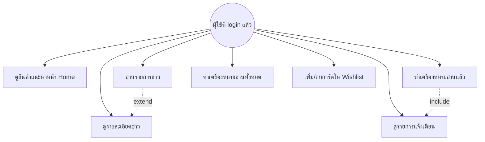

# Analysis & Design — CardVerse
### ขอบเขต: Home / News / Notifications / Wishlist (Collection)

เอกสารนี้อ้างอิงจากโค้ดจริงในโปรเจกต์ (Prisma schema: `packages/db/prisma/schema.prisma`, NestJS controllers: `apps/api/src/**`) เพื่ออธิบายการวิเคราะห์ความต้องการและออกแบบ Use Case ของระบบในส่วนที่รับผิดชอบ

สำหรับแผนภาพสถาปัตยกรรมระบบ (System Architecture, Sequence Diagram, ER Diagram) ดูเพิ่มเติมได้ที่ [`architecture.md`](./architecture.md)

---

## 1. Requirement Analysis

### 1.1 Functional Requirements

| รหัส | ความต้องการ | Endpoint ที่เกี่ยวข้อง |
|---|---|---|
| FR-01 | ผู้ใช้เห็นสินค้าแนะนำ/เทรนด์ในหน้า Home (Hero Carousel + Featured Products) | `GET /products` (filter `isFeatured`, `isTrending`) |
| FR-02 | ผู้ใช้อ่านข่าว/กิจกรรมในหน้า News (list) | `GET /news` |
| FR-03 | ผู้ใช้ดูรายละเอียดข่าวแต่ละชิ้น | `GET /news/:slug` |
| FR-04 | ผู้ใช้รับ Notification และคลิกเพื่อทำเครื่องหมายว่าอ่านแล้ว พร้อม redirect ไปหน้าที่ลิงก์ไว้ | `GET /notifications`, `POST /notifications/:id/read` |
| FR-05 | ผู้ใช้ทำเครื่องหมายอ่านทั้งหมด | `POST /notifications/read-all` |
| FR-06 | ผู้ใช้เพิ่ม/ลบการ์ดในรายการโปรด (Wishlist) | `GET /collection/wishlist`, `POST /collection/wishlist/toggle` |
| FR-07 | แสดง Badge จำนวน Notification ที่ยังไม่อ่าน และจำนวนรายการใน Wishlist | คำนวณจาก field `read: false` และความยาว array ของ wishlist |

### 1.2 Non-Functional Requirements

| รหัส | ความต้องการ |
|---|---|
| NFR-01 | หน้า Home/News ต้องโหลดไวโดยใช้ Server Components ของ Next.js 15 App Router |
| NFR-02 | ทุก endpoint ที่เกี่ยวกับ Notification/Wishlist ต้องยืนยันตัวตนผู้ใช้ผ่าน `@CurrentUser()` decorator ก่อนเข้าถึงข้อมูล |
| NFR-03 | การ toggle wishlist ต้องเป็น idempotent operation (กด toggle ซ้ำแล้วสลับสถานะถูกต้อง ไม่สร้างข้อมูลซ้ำ — บังคับด้วย `@@unique([userId, catalogItemId])` ในระดับ database) |
| NFR-04 | ระบบรองรับ i18n (TH/EN) ผ่าน next-intl |

---

## 2. Use Case Diagram

### 2.1 คำอธิบาย Use Case

| Use Case | Actor | คำอธิบาย |
|---|---|---|
| UC1 | ผู้ใช้ | เข้าหน้าแรกแล้วเห็นสินค้าที่ระบบคัดเลือกมาแสดง (featured/trending) |
| UC2 | ผู้ใช้ | ดูรายการข่าวสารทั้งหมดที่เผยแพร่แล้ว (`published: true`) |
| UC3 | ผู้ใช้ | คลิกจากรายการข่าวเพื่อดูเนื้อหาเต็มของข่าวนั้น |
| UC4 | ผู้ใช้ | เปิดหน้า Notifications เพื่อดูการแจ้งเตือนทั้งหมดของตนเอง |
| UC5 | ผู้ใช้ | คลิกที่รายการแจ้งเตือนหนึ่งรายการเพื่อทำเครื่องหมายว่าอ่านแล้วและนำทางไปหน้าที่เกี่ยวข้อง |
| UC6 | ผู้ใช้ | กดปุ่ม "อ่านทั้งหมด" เพื่อล้างสถานะยังไม่อ่านของทุกรายการพร้อมกัน |
| UC7 | ผู้ใช้ | กดสัญลักษณ์หัวใจ/ดาวที่การ์ดสินค้าเพื่อเพิ่มหรือลบออกจาก Wishlist |

---

## 3. สรุป

ความต้องการในส่วนที่รับผิดชอบ (Home, News, Notifications, Wishlist) ถูกออกแบบให้พึ่งพา Backend API ที่มีอยู่แล้วทั้งหมด โดยงานหลักของ Frontend คือการเรียกใช้ endpoint ที่ถูกต้อง จัดการ state ของ UI (unread badge, wishlist count) ให้สอดคล้องกับข้อมูลจริงใน database