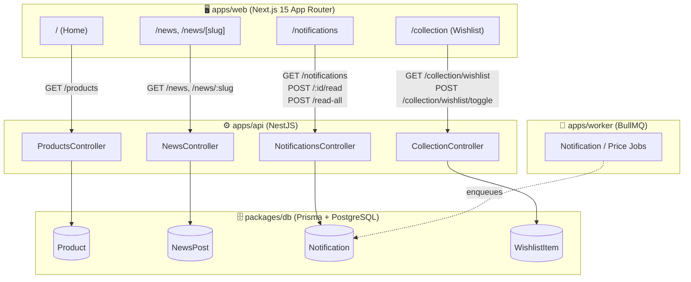
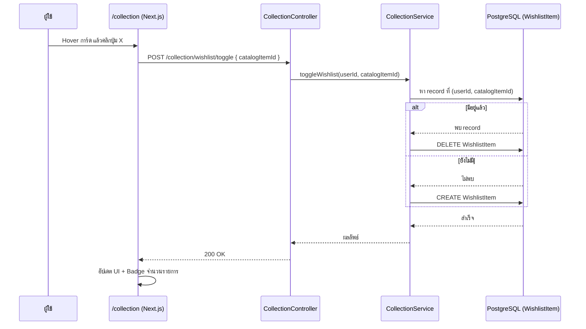
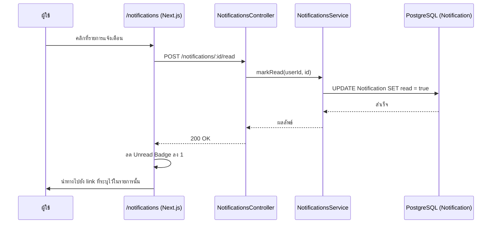
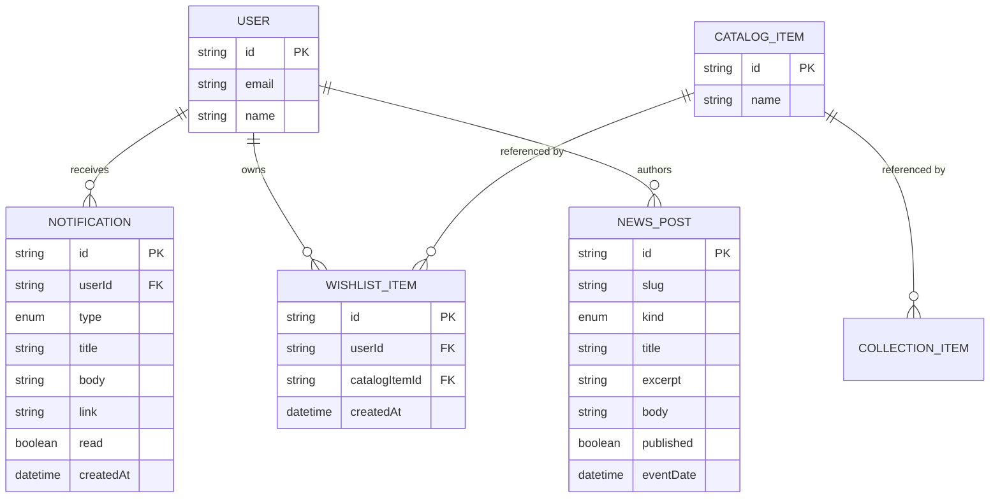

# System Architecture — CardVerse
### ขอบเขต: Home / News / Notifications / Wishlist (Collection)

เอกสารนี้อธิบายสถาปัตยกรรมระบบในส่วนที่รับผิดชอบ อ้างอิงจากโค้ดจริง (`packages/db/prisma/schema.prisma`, `apps/api/src/**`, `apps/web/src/app/**`)

สำหรับ Requirement Analysis และ Use Case Diagram ดูเพิ่มเติมได้ที่ [`analysis-design.md`](./analysis-design.md)

---

## 1. System Architecture Diagram

### 1.1 Component Responsibility

| Layer | Component | หน้าที่ |
|---|---|---|
| Frontend | `apps/web/src/app/page.tsx` | Home: Hero Carousel + Featured Products |
| Frontend | `apps/web/src/app/news/**` | News list + detail page |
| Frontend | `apps/web/src/app/notifications/page.tsx` | รายการแจ้งเตือน + mark-read |
| Frontend | `apps/web/src/app/collection/page.tsx` | Wishlist พร้อม toggle |
| Backend | `NotificationsController` / `NotificationsService` | จัดการ read/read-all |
| Backend | `CollectionController` / `CollectionService` | จัดการ wishlist toggle (idempotent) |
| Backend | `NewsController` / `NewsService` | ดึงรายการข่าวและรายละเอียด |
| Data | Prisma models: `Notification`, `WishlistItem`, `NewsPost`, `CatalogItem` | เก็บข้อมูลจริงใน PostgreSQL |

---

## 2. Sequence Diagram: Toggle Wishlist

## 2.1 Sequence Diagram: Mark Notification as Read

---

## 3. Entity Relationship Diagram

อ้างอิงจาก `packages/db/prisma/schema.prisma` จริง (เฉพาะส่วนที่เกี่ยวข้องกับขอบเขตนี้):

---

## 4. สรุป

สถาปัตยกรรมของระบบในส่วนที่รับผิดชอบใช้รูปแบบ Client-Server แยกชั้นชัดเจน: Next.js Frontend เรียกใช้ REST API ของ NestJS ซึ่งเชื่อมต่อกับ PostgreSQL ผ่าน Prisma ORM โดยมี BullMQ Worker ทำหน้าที่สร้าง Notification แบบ Asynchronous อยู่เบื้องหลัง การ toggle wishlist ถูกออกแบบให้ idempotent ผ่าน unique constraint ระดับ database เพื่อป้องกันข้อมูลซ้ำซ้อน