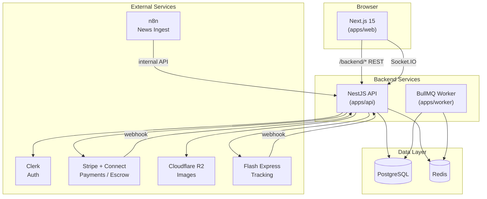
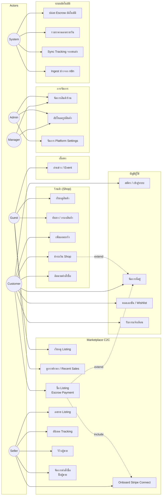

# CardVerse

**Full-stack collectible-card e-commerce marketplace** — ร้านค้าออฟฟิเชียล + Marketplace แบบ C2C พร้อม Escrow, กราฟราคาตลาด, และระบบจัดส่ง

[](https://github.com/danaiwut/Card_sell_Ecommerce/actions/workflows/ci.yml)

---

## สารบัญ

- [ภาพรวมระบบ](#ภาพรวมระบบ)
- [Tech Stack](#tech-stack)
- [Use Case Diagram](#use-case-diagram)
- [Class Diagram](#class-diagram)
- [SLA — Service Level Agreement](#sla--service-level-agreement)
- [UAT — User Acceptance Testing](#uat--user-acceptance-testing)
- [วิธีรันโปรเจ็กต์](#วิธีรันโปรเจ็กต์)
- [โครงสร้าง Monorepo](#โครงสร้าง-monorepo)
- [Deployment](#deployment)

---

## ภาพรวมระบบ

| โมดูล | คำอธิบาย |
| --- | --- |
| **Shop** | ร้านค้าออฟฟิเชียล — ขาย booster box, deck, single card, accessory ครบ 20 หมวดหมู่ |
| **Marketplace** | ลงขาย C2C พร้อม Escrow (Stripe Connect), กราฟราคาจากยอดขายจริง, live feed recent sales |
| **Shipping** | ผู้ขายอัปเดต carrier + tracking; Escrow ปล่อยเงินอัตโนมัติหลังจัดส่งสำเร็จ |
| **Collection** | คอลเลกชันส่วนตัว + wishlist |
| **News** | ข่าวสาร / event / set release (รองรับ ingest จาก n8n) |
| **Roles** | `customer` · `manager` · `admin` |

---

## Tech Stack

### สรุปตาม Layer

| Layer | เทคโนโลยี | ใช้สำหรับอะไร |
| --- | --- | --- |
| **Frontend** | Next.js 15, React 19, TypeScript | หน้าเว็บ storefront, marketplace, dashboard, admin |
| **Styling** | Tailwind CSS, Lucide Icons, GSAP | UI/UX, animation, responsive design |
| **State / Data** | TanStack Query | cache + fetch ข้อมูลจาก API ฝั่ง client |
| **Charts** | Recharts | กราฟราคาตลาด (market price chart) |
| **Realtime** | Socket.IO Client | live feed "recent sales" บน marketplace |
| **Backend API** | NestJS 11, Express 5 | REST API, business logic, webhook handlers |
| **Realtime Server** | Socket.IO (NestJS Gateway) | broadcast ยอดขายล่าสุดแบบ real-time |
| **Background Jobs** | BullMQ + Worker app | escrow release, price aggregation, notifications |
| **Database** | PostgreSQL 16 | เก็บข้อมูลหลักทั้งหมด (users, orders, listings, trades) |
| **ORM** | Prisma | schema, migrations, type-safe queries |
| **Cache / Queue** | Redis 7 | BullMQ queue backend + caching |
| **Auth** | Clerk | sign-in/sign-up, JWT, role-based access |
| **Payments** | Stripe + Stripe Connect | shop checkout, marketplace escrow, seller payout |
| **Storage** | Cloudflare R2 (S3 API) | อัปโหลดรูปสินค้า (presigned URL) |
| **Shipping** | Flash Express API (optional) | auto-tracking webhook จากขนส่ง |
| **i18n** | Custom i18n (TH/EN) | สลับภาษาไทย–อังกฤษ |
| **Monorepo** | pnpm + Turborepo | จัดการ packages และ build pipeline |
| **Validation** | Zod | validate request/response ร่วมกันใน `packages/shared` |
| **CI** | GitHub Actions | build + typecheck ทุก push |
| **Container** | Docker Compose | PostgreSQL + Redis สำหรับ dev local |
| **Automation** | n8n (optional) | ingest ข่าวจาก external source |

### แผนภาพสถาปัตยกรรม



### อธิบายรายเทคโนโลยี — ใช้ที่ส่วนไหน

| เทคโนโลยี | Package / App | หน้าที่เฉพาะ |
| --- | --- | --- |
| **Next.js 15** | `apps/web` | App Router, SSR/CSR, proxy `/backend/*` → NestJS, middleware auth |
| **NestJS** | `apps/api` | modules: cart, orders, marketplace, payments, shipping, admin, news |
| **BullMQ Worker** | `apps/worker` | `escrow-release`, `price-aggregation`, `notification` processors |
| **Prisma** | `packages/db` | schema 40+ models, seed data, Prisma Studio |
| **@cardverse/shared** | `packages/shared` | enums, DTO, Zod schemas, taxonomy 20 categories |
| **Clerk** | web + api | `@clerk/nextjs` ฝั่ง frontend, `@clerk/backend` verify JWT ฝั่ง API |
| **Stripe** | api | Checkout Session (shop), PaymentIntent + Connect Transfer (marketplace escrow) |
| **Socket.IO** | web + api | `realtime` module — push recent sales ไปยัง marketplace page |
| **Cloudflare R2** | api (`storage`) | `POST /storage/presign` → client upload ตรงไป R2 |
| **TanStack Query** | web | `useQuery` / `useMutation` สำหรับ cart, orders, listings |
| **Recharts** | web | กราฟราคา `PricePoint` + `Trade` บนหน้า catalog item |
| **Turborepo** | root | `pnpm dev` รัน web + api + worker พร้อมกัน |
| **Vitest** | api | unit tests สำหรับ business logic |

---

## Use Case Diagram

### Actors

| Actor | คำอธิบาย |
| --- | --- |
| **Guest** | ผู้เยี่ยมชมที่ยังไม่ login |
| **Customer** | ลูกค้าที่ login แล้ว — ซื้อ, สะสม, wishlist |
| **Seller** | ลูกค้าที่ลงขายบน marketplace (role เดียวกับ customer + Stripe Connect) |
| **Manager** | จัดการสินค้าร้านค้า, อัปโหลดรูป |
| **Admin** | สิทธิ์สูงสุด — จัดการระบบ, products, settings |
| **System** | Worker, webhook, cron — ทำงานอัตโนมัติเบื้องหลัง |



### รายละเอียด Use Cases หลัก

| ID | Use Case | Actor | คำอธิบาย |
| --- | --- | --- | --- |
| UC-01 | เรียกดูสินค้า Shop | Guest, Customer | ดู catalog 20 หมวด, featured, trending |
| UC-02 | ซื้อสินค้า Shop | Customer | cart → checkout → Stripe Checkout (หรือ mock) |
| UC-03 | ซื้อ Marketplace Listing | Customer | PaymentIntent + เงินเข้า Escrow |
| UC-04 | ลงขาย Listing | Seller | เลือก CatalogItem, กำหนดราคา/สภาพ |
| UC-05 | อัปเดต Tracking | Seller | ระบุ carrier + tracking number |
| UC-06 | ปล่อย Escrow | System | Worker ปล่อยเงินให้ seller หลัง `ESCROW_AUTO_RELEASE_DAYS` |
| UC-07 | กราฟราคาตลาด | Guest, Customer | แสดง `PricePoint` + `Trade` จากยอดขายจริง |
| UC-08 | จัดการสินค้า | Manager, Admin | CRUD products, upload รูปผ่าน R2 |
| UC-09 | คอลเลกชัน / Wishlist | Customer | บันทึกการ์ดที่สะสม / อยากได้ |
| UC-10 | รีวิวผู้ขาย | Customer | ให้คะแนนหลัง order completed |

---

## Class Diagram

แผนภาพ class หลักจาก Prisma schema — แสดง entity, relationship และ enum สำคัญ


### Enums หลัก

| Enum | ค่าที่ใช้ |
| --- | --- |
| `Role` | `customer`, `manager`, `admin` |
| `OrderStatus` | `PENDING` → `PAID` → `SHIPPED` → `DELIVERED` |
| `MarketplaceOrderStatus` | `PENDING_PAYMENT` → `PAID_HELD` → `SHIPPED` → `DELIVERED` → `COMPLETED` |
| `ListingStatus` | `ACTIVE`, `SOLD`, `CANCELLED`, `SUSPENDED` |
| `ShipmentStatus` | `PENDING` → `SHIPPED` → `IN_TRANSIT` → `DELIVERED` |
| `CardCondition` | `MINT`, `NEAR_MINT`, `EXCELLENT`, `GOOD`, `PLAYED`, `DAMAGED` |

---

## SLA — Service Level Agreement

> เป้าหมายระดับบริการสำหรับ **Production** (Vercel + Railway/Render + Supabase/Neon + Upstash)

### Availability & Performance

| Metric | เป้าหมาย | ช่วงวัด | หมายเหตุ |
| --- | --- | --- | --- |
| **Uptime (Web + API)** | ≥ 99.5% | รายเดือน | ไม่รวม planned maintenance |
| **API Response (p95)** | < 500 ms | REST read endpoints | catalog, products, listings |
| **API Response (p95)** | < 1,500 ms | REST write endpoints | checkout, create listing |
| **Web Page Load (LCP)** | < 2.5 s | หน้าหลัก, shop, marketplace | บน 4G / broadband |
| **WebSocket Latency** | < 2 s | recent sales feed | จาก trade ใหม่ → client |
| **Database Query (p95)** | < 200 ms | indexed queries | Prisma + PostgreSQL |

### Business Operations

| กระบวนการ | เป้าหมาย | รายละเอียด |
| --- | --- | --- |
| **Shop Payment** | ≤ 30 วินาที | Stripe Checkout redirect → webhook confirm |
| **Marketplace Escrow Hold** | ทันทีหลังชำระ | สถานะ `PAID_HELD` ภายใน 60 วินาที |
| **Escrow Auto-Release** | ภายใน 24 ชม. หลังครบกำหนด | Worker ตรวจ `releaseDueAt` ทุกชั่วโมง |
| **Price Aggregation** | อัปเดตภายใน 1 ชม. | Worker สร้าง `PricePoint` รายวัน |
| **Tracking Sync** | ภายใน 4 ชม. | Flash webhook หรือ manual update |
| **Image Upload** | ≤ 10 วินาที | presign + PUT ไป R2 (ไฟล์ ≤ 5 MB) |
| **Notification Delivery** | ≤ 5 นาที | หลัง order/shipment status เปลี่ยน |

### Support & Incident

| ระดับ | คำอธิบาย | Response Time | Resolution Target |
| --- | --- | --- | --- |
| **P1 — Critical** | ระบบล่ม, ชำระเงินไม่ได้ | ≤ 1 ชม. | ≤ 4 ชม. |
| **P2 — High** | marketplace/escrow ผิดพลาด | ≤ 4 ชม. | ≤ 24 ชม. |
| **P3 — Medium** | ฟีเจอร์เสียบางส่วน | ≤ 1 วันทำการ | ≤ 3 วันทำการ |
| **P4 — Low** | UI/UX, คำถามทั่วไป | ≤ 2 วันทำการ | ตามแผน sprint |

### Planned Maintenance

- แจ้งล่วงหน้า **≥ 24 ชม.** ผ่านหน้าเว็บ / notification
- หน้าต่าง maintenance แนะนำ: **อังคาร 02:00–04:00 (UTC+7)**
- Rollback ภายใน **30 นาที** หาก deploy ล้มเหลว

---

## UAT — User Acceptance Testing

> ชุดทดสอบยอมรับก่อน go-live — ทำได้ทั้ง **Demo mode** (ไม่ต้องมี API key) และ **Production mode**

### สภาพแวดล้อมทดสอบ

| รายการ | Demo Mode | Production Mode |
| --- | --- | --- |
| Auth | Dev session login ที่ `/account` | Clerk sign-in/sign-up |
| Payment | Mock auto-capture | Stripe test keys |
| Connect | Auto-onboard mock | Stripe Connect test account |
| DB | `pnpm db:seed` | staging database |

### UAT Test Cases

#### TC-01: Authentication & Roles

| Step | Action | Expected Result | ✓ |
| --- | --- | --- | --- |
| 1 | เปิด `/account` → login เป็น `customer` | เข้าสู่ระบบสำเร็จ, เห็น sidebar บัญชี | ☐ |
| 2 | Login เป็น `manager` | เข้า `/admin/products` ได้ | ☐ |
| 3 | Login เป็น `admin` | เข้า admin + จัดการ settings ได้ | ☐ |
| 4 | Logout แล้วเข้าหน้า `/account/orders` | redirect ไป sign-in | ☐ |

#### TC-02: Shop — ซื้อสินค้าร้านค้า

| Step | Action | Expected Result | ✓ |
| --- | --- | --- | --- |
| 1 | เปิด `/shop` → เลือกสินค้า → Add to cart | ตะกร้ามีสินค้า, จำนวนถูกต้อง | ☐ |
| 2 | เปิด `/cart` → ปรับ quantity | ยอดรวมอัปเดต | ☐ |
| 3 | Checkout → ยืนยันที่อยู่ → ชำระเงิน | order สร้างสำเร็จ, สถานะ `PAID` | ☐ |
| 4 | เปิด `/account/orders` | เห็นคำสั่งซื้อใหม่ | ☐ |

#### TC-03: Marketplace — ซื้อขาย + Escrow

| Step | Action | Expected Result | ✓ |
| --- | --- | --- | --- |
| 1 | Seller: `/account/sell` → สร้าง listing | listing แสดงที่ `/marketplace` | ☐ |
| 2 | Buyer: ซื้อ listing | order สถานะ `PAID_HELD`, เงินเข้า escrow | ☐ |
| 3 | Seller: อัปเดต carrier + tracking | shipment status เปลี่ยนเป็น `SHIPPED` | ☐ |
| 4 | รอ escrow release (หรือ trigger worker) | สถานะ `COMPLETED`, seller ได้ payout | ☐ |
| 5 | Buyer: รีวิวผู้ขาย | rating อัปเดตบน seller profile | ☐ |

#### TC-04: Market Price & Recent Sales

| Step | Action | Expected Result | ✓ |
| --- | --- | --- | --- |
| 1 | เปิด `/marketplace/[catalogItemId]` | เห็นกราฟราคา (Recharts) | ☐ |
| 2 | ดู recent sales feed | แสดง trade ล่าสุด | ☐ |
| 3 | ซื้อ listing สำเร็จ | feed อัปเดตแบบ real-time (Socket.IO) | ☐ |

#### TC-05: Collection & Wishlist

| Step | Action | Expected Result | ✓ |
| --- | --- | --- | --- |
| 1 | กด wishlist บน catalog item | ปรากฏใน `/collection` tab wishlist | ☐ |
| 2 | เพิ่มการ์ดเข้า collection | แสดงใน collection พร้อม quantity | ☐ |
| 3 | ลบออกจาก wishlist | หายจากรายการ | ☐ |

#### TC-06: Shipping & Tracking

| Step | Action | Expected Result | ✓ |
| --- | --- | --- | --- |
| 1 | Seller ใส่ tracking number | timeline แสดงสถานะ | ☐ |
| 2 | อัปเดตเป็น `DELIVERED` | order/marketplace order สถานะ delivered | ☐ |
| 3 | ตรวจ `/account/shipments` | เห็นรายการจัดส่งครบ | ☐ |

#### TC-07: Admin / Manager

| Step | Action | Expected Result | ✓ |
| --- | --- | --- | --- |
| 1 | Manager: สร้าง product ใหม่ที่ `/admin/products` | product แสดงใน `/shop` | ☐ |
| 2 | อัปโหลดรูป (R2 configured) | รูปแสดงบน product card | ☐ |
| 3 | แก้ไข stock / price | ค่าอัปเดตใน DB | ☐ |

#### TC-08: News & Notifications

| Step | Action | Expected Result | ✓ |
| --- | --- | --- | --- |
| 1 | เปิด `/news` | เห็นรายการข่าว / event | ☐ |
| 2 | เปิด `/news/[slug]` | อ่านเนื้อหาเต็มได้ | ☐ |
| 3 | หลัง order อัปเดต | notification ใหม่ปรากฏในบัญชี | ☐ |

### UAT Sign-off Criteria

| เกณฑ์ | เป้าหมาย |
| --- | --- |
| Test cases ผ่าน | ≥ 95% (ไม่มี P1/P2 fail) |
| Escrow flow | ผ่านครบ TC-03 |
| Payment (production) | Stripe test mode ผ่านทุก scenario |
| Performance | API p95 ไม่เกิน SLA |
| Sign-off | Product Owner + Tech Lead อนุมัติเป็นหนังสือ |

---

## วิธีรันโปรเจ็กต์

### สิ่งที่ต้องมี

| โปรแกรม | เวอร์ชัน | ใช้ทำอะไร |
| --- | --- | --- |
| **Node.js** | ≥ 20 | รัน Next.js, NestJS, Worker |
| **pnpm** | 10.x | จัดการ monorepo |
| **Docker Desktop** | ล่าสุด | รัน PostgreSQL + Redis |

```bash
node -v          # v20+
pnpm -v          # 10.x
docker compose version
```

### รันครั้งแรก (Quick Start)

```bash
# 1) Clone
git clone https://github.com/danaiwut/Card_sell_Ecommerce.git
cd Card_sell_Ecommerce

# 2) ติดตั้ง dependencies
pnpm install

# 3) เปิด PostgreSQL + Redis
docker compose up -d

# 4) ตั้งค่า environment
cp .env.example .env

# 5) เตรียมฐานข้อมูล
pnpm db:generate
pnpm db:push
pnpm db:seed

# 6) สตาร์ท dev server (เปิดทิ้งไว้)
pnpm dev
```

เปิดเบราว์เซอร์: **http://localhost:3000**

### Services ที่รันขึ้นมา

| Service | Port | URL |
| --- | --- | --- |
| **Web (Next.js)** | 3000 | http://localhost:3000 |
| **API (NestJS)** | 4000 | http://localhost:4000 (internal) |
| **PostgreSQL** | 5432 | `localhost:5432` |
| **Redis** | 6379 | `localhost:6379` |
| **Worker (BullMQ)** | — | background process |

เบราว์เซอร์เรียกแค่ port **3000** — Next.js proxy REST ไป `/backend/*` และ Socket.IO ไป NestJS ที่ port 4000

### Demo Mode (ไม่ต้องมี API key)

เมื่อ `CLERK_*` และ `STRIPE_*` ว่างอยู่:

1. เปิด http://localhost:3000/account
2. เลือก role: `customer`, `manager`, หรือ `admin`
3. กด Sign in (dev session)

| หน้า | URL | ทำอะไรได้ |
| --- | --- | --- |
| หน้าแรก | `/` | hero, หมวดหมู่ 20 ประเภท |
| ร้านค้า | `/shop` | ซื้อสินค้าจากร้าน CardVerse |
| Marketplace | `/marketplace` | listing, กราฟราคา, recent sales |
| คอลเลกชัน | `/collection` | การ์ดของฉัน, wishlist |
| ขายของ | `/account/sell` | ลง listing, อัปเดต tracking |
| Admin | `/admin/products` | จัดการสินค้า (manager/admin) |

### Production Mode

ตั้งค่าใน `.env`:

```env
# Clerk
NEXT_PUBLIC_CLERK_PUBLISHABLE_KEY="pk_..."
CLERK_SECRET_KEY="sk_..."

# Stripe
STRIPE_SECRET_KEY="sk_..."
STRIPE_WEBHOOK_SECRET="whsec_..."
NEXT_PUBLIC_STRIPE_PUBLISHABLE_KEY="pk_..."

# Cloudflare R2 (optional — อัปโหลดรูป)
R2_ACCOUNT_ID="..."
R2_ACCESS_KEY_ID="..."
R2_SECRET_ACCESS_KEY="..."
R2_PUBLIC_URL="https://..."
```

### รันครั้งถัดไป

```bash
docker compose up -d    # ถ้า container ยังไม่ up
pnpm dev
```

### หยุดระบบ

```bash
# Ctrl+C ใน terminal ที่รัน pnpm dev
docker compose down
```

### คำสั่งที่มีประโยชน์

```bash
pnpm db:studio      # Prisma Studio — ดู/แก้ข้อมูลใน DB
pnpm typecheck      # ตรวจ TypeScript ทั้ง monorepo
pnpm build          # build production
pnpm lint           # lint ทุก package
```

### แก้ปัญหาที่พบบ่อย

| ปัญหา | สาเหตุ | วิธีแก้ |
| --- | --- | --- |
| `ERR_CONNECTION_REFUSED` | ยังไม่รัน `pnpm dev` | รัน `pnpm dev` แล้วรอ web + api + worker ขึ้นครบ |
| `DATABASE_URL not found` | ไม่มี `.env` | `cp .env.example .env` |
| `P1001 Can't reach database` | Postgres ยังไม่ up | `docker compose up -d` |
| Port 3000 ถูกใช้ | process อื่นครอบ | `lsof -i :3000` แล้วปิด process |

> คู่มือรันแบบละเอียด (ภาษาไทย): ดู [`app.md`](./app.md)

---

## โครงสร้าง Monorepo

```
Card_sell_Ecommerce/
├── apps/
│   ├── web/          # Next.js 15 — storefront, marketplace, dashboards
│   ├── api/          # NestJS — REST API + Socket.IO gateway
│   └── worker/       # BullMQ — escrow release, price aggregation, notifications
├── packages/
│   ├── db/           # Prisma schema + client + seed
│   ├── shared/       # types, Zod schemas, 20-category taxonomy
│   └── ui/           # shared React components
├── docs/             # design docs, n8n workflows
├── docker-compose.yml
├── .env.example
└── turbo.json
```

---

## Deployment

| Component | Recommended Host | Dockerfile |
| --- | --- | --- |
| `apps/web` | **Vercel** (Next.js) | — |
| `apps/api` | Railway / Render / Fly | `apps/api/Dockerfile` |
| `apps/worker` | Railway / Render / Fly | `apps/worker/Dockerfile` |
| PostgreSQL | **Supabase** / Neon | — |
| Redis | **Upstash** | — |
| Images | **Cloudflare R2** | — |

### Checklist ก่อน Deploy

- [ ] ตั้ง `DATABASE_URL`, `REDIS_URL` เดียวกันทุก service
- [ ] ตั้ง `INTERNAL_API_SECRET` เดียวกันบน api + worker
- [ ] ตั้ง Stripe webhook → `POST {API_URL}/payments/webhook`
- [ ] ตั้ง Clerk webhook (ถ้าใช้) → `POST {API_URL}/auth/webhook`
- [ ] ตั้ง `CORS_ORIGIN` เป็น production domain
- [ ] รัน `pnpm db:migrate` บน production database

CI build + typecheck ทุก push ผ่าน [`.github/workflows/ci.yml`](./.github/workflows/ci.yml)

---

## License

Private project — All rights reserved.
