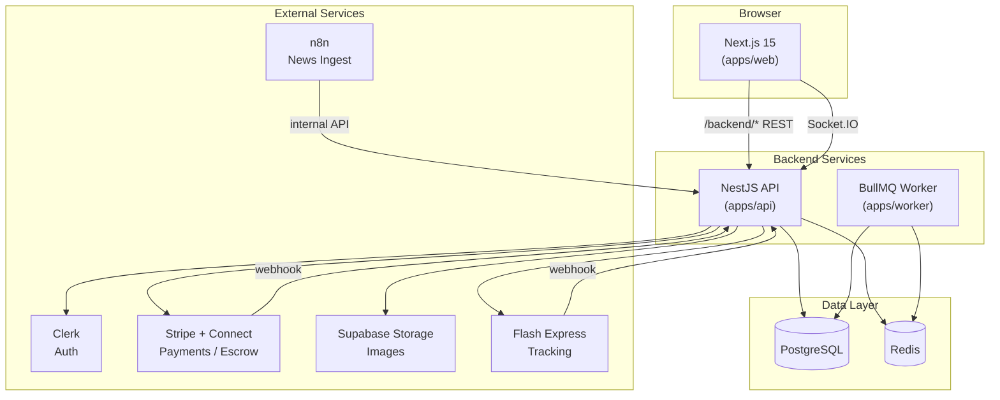
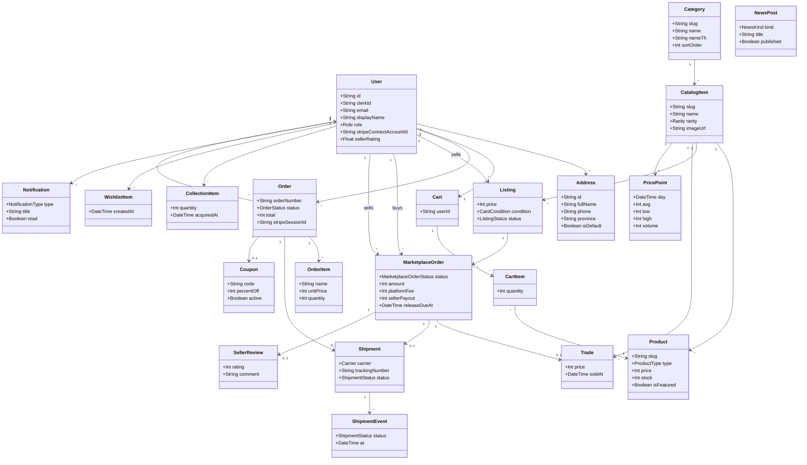
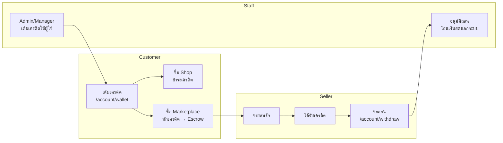
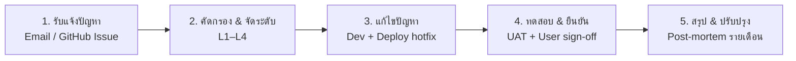

# CardVerse

**Full-stack collectible-card e-commerce marketplace** — ร้านค้าออฟฟิเชียล + Marketplace แบบ C2C พร้อม Escrow, กราฟราคาตลาด, และระบบจัดส่ง

[CI](https://github.com/danaiwut/Card_sell_Ecommerce/actions/workflows/ci.yml)

---

## สารบัญ

- [ภาพรวมระบบ](#ภาพรวมระบบ)
- [User Personas](#user-personas)
- [Tech Stack](#tech-stack)
- [Use Case Diagram](#use-case-diagram)
- [Class Diagram](#class-diagram)
- [SLA — Service Level Agreement](#sla--service-level-agreement)
- [UAT — User Acceptance Testing](#uat--user-acceptance-testing)
- [วิธีรันโปรเจ็กต์](#วิธีรันโปรเจ็กต์)
- [โครงสร้าง Monorepo](#โครงสร้าง-monorepo)
- [Deployment](#deployment)

---


## ภาพรวมระบบ


| โมดูล                | คำอธิบาย                                                                               |
| -------------------- | -------------------------------------------------------------------------------------- |
| **Shop**             | ร้านค้าออฟฟิเชียล — ขาย booster box, deck, single card, accessory ครบ 20 หมวดหมู่      |
| **Marketplace**      | ลงขาย C2C พร้อม Escrow (Stripe Connect), กราฟราคาจากยอดขายจริง, live feed recent sales |
| **Shipping**         | ผู้ขายอัปเดต carrier + tracking; Escrow ปล่อยเงินอัตโนมัติหลังจัดส่งสำเร็จ             |
| **Collection**       | คอลเลกชันส่วนตัว + wishlist                                                            |
| **Credits / Wallet** | เติมเครดิต → ใช้ซื้อแทนเงินสด, ผู้ขายถอนเครดิตผ่านเมเนเจอร์                            |
| **News**             | ข่าวสาร / event / set release (รองรับ ingest จาก n8n)                                  |
| **Roles**            | `customer` · `manager` · `admin`                                                       |


---


## User Personas

> Persona หลัก 2 กลุ่มที่ CardVerse ออกแบบมาเพื่อ — ครอบคลุมทั้งฝั่งซื้อ-ขาย C2C และฝั่งดูแลแพลตฟอร์ม


### Persona 1 — น้องบอล (นักสะสมการ์ด / Customer)


| หัวข้อ                   | รายละเอียด                                                                                                                                     |
| ------------------------ | ---------------------------------------------------------------------------------------------------------------------------------------------- |
| **อายุ / อาชีพ**         | 22 ปี — นักศึกษา / พนักงานออฟฟิศ                                                                                                               |
| **เป้าหมาย**             | ซื้อการ์ดที่ต้องการในราคาดี, ติดตามราคาตลาด, สะสมในคอลเลกชัน, ขายการ์ดซ้ำเมื่อไม่ใช้แล้ว                                                       |
| **Pain Points**          | กลัวโดนหลอกเมื่อซื้อ C2C, ไม่รู้ว่าราคาตลาดตอนนี้เท่าไหร่, อยากได้ระบบชำระที่ปลอดภัย                                                           |
| **พฤติกรรมบน CardVerse** | เริ่มจาก `/shop` และ `/marketplace` → เติมเครดิตที่ `/account/wallet` → ซื้อด้วย Escrow → เก็บการ์ดใน `/collection` → ลงขายที่ `/account/sell` |
| **ฟีเจอร์ที่ใช้บ่อย**    | Wishlist, กราฟราคา, Recent sales, Make an Offer, คูปอง WELCOME10, แจ้งเตือน order                                                              |
| **Role ในระบบ**          | `customer`                                                                                                                                     |


### Persona 2 — คุณพล (ผู้จัดการแพลตฟอร์ม / Manager)


| หัวข้อ                   | รายละเอียด                                                                                                       |
| ------------------------ | ---------------------------------------------------------------------------------------------------------------- |
| **อายุ / อาชีพ**         | 32 ปี — ผู้จัดการร้านการ์ด / Ops แพลตฟอร์ม                                                                       |
| **เป้าหมาย**             | ดูแลสินค้าร้านออฟฟิเชียล, ควบคุม listing ที่ผิดปกติ, อนุมัติถอนเครดิตผู้ขาย, ตั้งค่า fee/escrow                  |
| **Pain Points**          | ต้องเห็น KPI รวมในที่เดียว, จัดการสต็อก/ราคาได้เร็ว, ลดงาน manual เรื่องอนุมัติและข่าว                           |
| **พฤติกรรมบน CardVerse** | Login → `/admin` → ดู Dashboard KPI → แก้ product/ราคา/สต็อก → suspend listing → อนุมัติถอนเครดิต → publish ข่าว |
| **ฟีเจอร์ที่ใช้บ่อย**    | Admin Products, Listings, Wallet grant/approve, Platform settings, News draft, User search/filter                |
| **Role ในระบบ**          | `manager` (Admin ใช้ flow เดียวกัน + เปลี่ยน role ผู้ใช้ได้)                                                     |


---


## Tech Stack


### สรุปตาม Layer


| Layer               | เทคโนโลยี                        | ใช้สำหรับอะไร                                           |
| ------------------- | -------------------------------- | ------------------------------------------------------- |
| **Frontend**        | Next.js 15, React 19, TypeScript | หน้าเว็บ storefront, marketplace, dashboard, admin      |
| **Styling**         | Tailwind CSS, Lucide Icons, GSAP | UI/UX, animation, responsive design                     |
| **State / Data**    | TanStack Query                   | cache + fetch ข้อมูลจาก API ฝั่ง client                 |
| **Charts**          | Recharts                         | กราฟราคาตลาด (market price chart)                       |
| **Realtime**        | Socket.IO Client                 | live feed "recent sales" บน marketplace                 |
| **Backend API**     | NestJS 11, Express 5             | REST API, business logic, webhook handlers              |
| **Realtime Server** | Socket.IO (NestJS Gateway)       | broadcast ยอดขายล่าสุดแบบ real-time                     |
| **Background Jobs** | BullMQ + Worker app              | escrow release, price aggregation, notifications        |
| **Database**        | PostgreSQL 16                    | เก็บข้อมูลหลักทั้งหมด (users, orders, listings, trades) |
| **ORM**             | Prisma                           | schema, migrations, type-safe queries                   |
| **Cache / Queue**   | Redis 7                          | BullMQ queue backend + caching                          |
| **Auth**            | Clerk                            | sign-in/sign-up, JWT, role-based access                 |
| **Payments**        | Stripe + Stripe Connect          | shop checkout, marketplace escrow, seller payout        |
| **Storage**         | Supabase Storage                 | อัปโหลดรูปสินค้า (signed upload URL)                    |
| **Shipping**        | Flash Express API (optional)     | auto-tracking webhook จากขนส่ง                          |
| **i18n**            | Custom i18n (TH/EN)              | สลับภาษาไทย–อังกฤษ                                      |
| **Monorepo**        | pnpm + Turborepo                 | จัดการ packages และ build pipeline                      |
| **Validation**      | Zod                              | validate request/response ร่วมกันใน `packages/shared`   |
| **CI**              | GitHub Actions                   | build + typecheck ทุก push                              |
| **Container**       | Docker Compose                   | PostgreSQL + Redis สำหรับ dev local                     |
| **Automation**      | n8n (optional)                   | ingest ข่าวจาก external source                          |


### แผนภาพสถาปัตยกรรม




### อธิบายรายเทคโนโลยี — ใช้ที่ส่วนไหน


| เทคโนโลยี             | Package / App     | หน้าที่เฉพาะ                                                                   |
| --------------------- | ----------------- | ------------------------------------------------------------------------------ |
| **Next.js 15**        | `apps/web`        | App Router, SSR/CSR, proxy `/backend/`* → NestJS, middleware auth              |
| **NestJS**            | `apps/api`        | modules: cart, orders, marketplace, payments, shipping, admin, news            |
| **BullMQ Worker**     | `apps/worker`     | `escrow-release`, `price-aggregation`, `notification` processors               |
| **Prisma**            | `packages/db`     | schema 40+ models, Prisma Studio                                               |
| **@cardverse/shared** | `packages/shared` | enums, DTO, Zod schemas, taxonomy 20 categories                                |
| **Clerk**             | web + api         | `@clerk/nextjs` ฝั่ง frontend, `@clerk/backend` verify JWT ฝั่ง API            |
| **Stripe**            | api               | Checkout Session (shop), PaymentIntent + Connect Transfer (marketplace escrow) |
| **Socket.IO**         | web + api         | `realtime` module — push recent sales ไปยัง marketplace page                   |
| **Supabase Storage**  | api (`storage`)   | `POST /storage/presign` → client upload ตรงไป Supabase bucket                  |
| **TanStack Query**    | web               | `useQuery` / `useMutation` สำหรับ cart, orders, listings                       |
| **Recharts**          | web               | กราฟราคา `PricePoint` + `Trade` บนหน้า catalog item                            |
| **Turborepo**         | root              | `pnpm dev` รัน web + api + worker พร้อมกัน                                     |
| **Vitest**            | api               | unit tests สำหรับ business logic                                               |


---


## Use Case Diagram

> แผนภาพ Use Case หลักของ CardVerse — จัดกลุ่มตาม Actor ให้อ่านง่าย (สไตล์เดียวกับ Class Diagram)


### Actors


| Actor        | บทบาท                                                          |
| ------------ | -------------------------------------------------------------- |
| **Customer** | ลูกค้า — ซื้อ, สะสม, ลงขาย, ใช้เครดิต                          |
| **Manager**  | ผู้จัดการ — ดูแลสินค้า, listing, ถอนเครดิต, ข่าว, settings     |
| **Admin**    | ผู้ดูแลระบบ — สิทธิ์ Manager + เปลี่ยน role ผู้ใช้             |
| **System**   | Worker / Webhook — escrow release, price aggregation, tracking |

```mermaid
flowchart TB
    subgraph CustomerUC["Customer — นักสะสมการ์ด"]
        direction TB
        UC_REG[สมัครสมาชิก]
        UC_LOGIN[เข้าสู่ระบบ]
        UC_SEARCH[ค้นหาการ์ด / สินค้า]
        UC_SHOP[ซื้อสินค้า Shop]
        UC_MKT[ซื้อบน Marketplace]
        UC_SELL[ลงขายการ์ด]
        UC_WISH[Wishlist / Collection]
        UC_HIST[ประวัติคำสั่งซื้อ]
        UC_WITHDRAW[ขอถอนเครดิต]
        UC_VERIFY[ยืนยันตัวตน]
        UC_INFO[ใส่ข้อมูลการสั่งซื้อ]
        UC_PAY[ชำระด้วยเครดิต]
        UC_CONFIRM[ข้อความยืนยัน / แจ้งเตือน]
        UC_ESCROW[Escrow Hold]
        UC_RELEASE[ยืนยันรับของ / ปล่อย Escrow]
        UC_OFFER[Make an Offer]

        UC_REG -.->|«include»| UC_VERIFY
        UC_SHOP -.->|«include»| UC_INFO
        UC_SHOP -.->|«include»| UC_PAY
        UC_SHOP -.->|«include»| UC_CONFIRM
        UC_MKT -.->|«include»| UC_PAY
        UC_MKT -.->|«include»| UC_ESCROW
        UC_MKT -.->|«include»| UC_CONFIRM
        UC_MKT -.->|«extend»| UC_OFFER
        UC_ESCROW -.->|«include»| UC_RELEASE
    end

    subgraph ManagerUC["Manager / Admin — ผู้จัดการแพลตฟอร์ม"]
        direction TB
        UC_CHECK[ตรวจสอบข้อมูล]
        UC_VIEW_ORD[ดูคำสั่งซื้อ Shop / Marketplace]
        UC_VIEW_LST[ดู / กรอง Listing]
        UC_CRUD[เพิ่ม / ปรับปรุงสินค้า]
        UC_SUSPEND[Suspend Listing]
        UC_WALLET[อนุมัติถอนเครดิต / Grant Wallet]
        UC_NEWS[จัดการ Draft ข่าว + Approve]
        UC_USERS[ค้นหา / กรอง Users]
        UC_SETTINGS[แก้ Fee % และ Escrow Days]
        UC_ROLE[เปลี่ยน Role ผู้ใช้]

        UC_CHECK -.->|«include»| UC_VIEW_ORD
        UC_CHECK -.->|«include»| UC_VIEW_LST
    end

    subgraph SystemUC["System — อัตโนมัติ"]
        direction TB
        UC_AUTO[ปล่อย Escrow อัตโนมัติ]
        UC_PRICE[รวมราคาตลาดรายวัน]
        UC_TRACK[Sync Tracking จากขนส่ง]
    end

    C((Customer)) --> UC_REG & UC_LOGIN & UC_SEARCH & UC_SHOP & UC_MKT & UC_SELL & UC_WISH & UC_HIST & UC_WITHDRAW
    M((Manager)) --> UC_CHECK & UC_CRUD & UC_SUSPEND & UC_WALLET & UC_NEWS & UC_USERS & UC_SETTINGS
    A((Admin)) --> UC_CHECK & UC_CRUD & UC_SUSPEND & UC_WALLET & UC_NEWS & UC_USERS & UC_SETTINGS & UC_ROLE
    SYS((System)) --> UC_AUTO & UC_PRICE & UC_TRACK
```





### สรุป Use Case หลัก


| ID    | Use Case               | Actor          | คำอธิบาย                                                     |
| ----- | ---------------------- | -------------- | ------------------------------------------------------------ |
| UC-01 | สมัคร / เข้าสู่ระบบ    | Customer       | Clerk sign-in หรือ dev session ที่ `/account`                |
| UC-02 | ซื้อสินค้า Shop        | Customer       | cart → checkout → ชำระเครดิต + คูปอง                         |
| UC-03 | ซื้อ Marketplace       | Customer       | หักเครดิต → Escrow `PAID_HELD` → ยืนยันรับของ                |
| UC-04 | ลงขายการ์ด             | Customer       | เลือก CatalogItem, กำหนดราคา/สภาพ ที่ `/account/sell`        |
| UC-05 | จัดการสินค้า           | Manager, Admin | CRUD products, อัปโหลดรูปผ่าน Supabase Storage               |
| UC-06 | อนุมัติถอนเครดิต       | Manager, Admin | ผู้ขายขอถอน → เมเนเจอร์อนุมัติที่ `/admin?tab=wallet`        |
| UC-07 | เปลี่ยน Role           | Admin          | promote/demote customer ↔ manager ↔ admin                    |
| UC-08 | ปล่อย Escrow อัตโนมัติ | System         | Worker ปล่อยเครดิตให้ seller หลัง `ESCROW_AUTO_RELEASE_DAYS` |


---


## Class Diagram

> แผนภาพ Class หลักจาก Prisma schema — แสดง **attributes**, **methods/relations** และ **enum** สำคัญ (รูปแบบ 3 ส่วน: ชื่อ class · fields · relationships)




### Enums หลัก


| Enum                     | ค่าที่ใช้                                                               |
| ------------------------ | ----------------------------------------------------------------------- |
| `Role`                   | `customer`, `manager`, `admin`                                          |
| `OrderStatus`            | `PENDING` → `PAID` → `SHIPPED` → `DELIVERED`                            |
| `MarketplaceOrderStatus` | `PENDING_PAYMENT` → `PAID_HELD` → `SHIPPED` → `DELIVERED` → `COMPLETED` |
| `ListingStatus`          | `ACTIVE`, `SOLD`, `CANCELLED`, `SUSPENDED`                              |
| `ShipmentStatus`         | `PENDING` → `SHIPPED` → `IN_TRANSIT` → `DELIVERED`                      |
| `CardCondition`          | `MINT`, `NEAR_MINT`, `EXCELLENT`, `GOOD`, `PLAYED`, `DAMAGED`           |


## ระบบเครดิต (Credit / Wallet)

> **Demo mode ใช้เครดิตแทนเงินสดทั้งหมด** — ไม่ต้องต่อ Stripe/Clerk ก็ทดสอบ flow ครบได้




| ฟีเจอร์             | หน้า/API            | คำอธิบาย                                   |
| ------------------- | ------------------- | ------------------------------------------ |
| เติมเครดิต (ลูกค้า) | `/account/wallet`   | Demo: เติมทันทีไม่ผ่าน payment gateway     |
| ชำระ Shop           | `/checkout`         | หักเครดิต + คูปอง + ค่าจัดส่ง              |
| ชำระ Marketplace    | กดซื้อ listing      | หักเครดิตเข้า Escrow (heldBalance)         |
| ปล่อย Escrow        | Worker auto-release | โอนเครดิตให้ผู้ขาย (sellerPayout)          |
| ถอนเครดิต           | `/account/withdraw` | ผู้ขายขอถอน → เมเนเจอร์อนุมัติ → โอนเงินสด |
| Admin เติมเครดิต    | `/admin?tab=wallet` | Manager/Admin ให้เครดิตผู้ใช้              |
| คืนเครดิต Shop      | Admin Shop Orders   | คืนเครดิตเมื่อ refund                      |


**ทำไมใช้เครดิต?** ลูกค้าต้องเติมเครดิตก่อนซื้อ ทำให้ยากต่อการซื้อของตัวเองเพื่อปั๊มยอดขาย (self-purchase) และแยกเงินสดจริงออกจากระบบ marketplace

---


## SLA — Service Level Agreement

> **Service Level Agreement (SLA)** — ข้อตกลงระหว่างผู้ให้บริการ (CardVerse Platform) กับผู้ใช้งาน ที่กำหนดมาตรฐานคุณภาพการให้บริการ ระยะเวลาตอบสนอง และขั้นตอนแก้ไขปัญหา


### ความสำคัญของ SLA


| ประโยชน์           | รายละเอียด                                       |
| ------------------ | ------------------------------------------------ |
| สร้างความเชื่อมั่น | ผู้ใช้และทีม ops รู้ว่าระบบต้องทำงานได้ในระดับใด |
| กำหนดความคาดหวัง   | ชัดเจนทั้ง uptime, response time และเวลาแก้ไข    |
| ลดความเสี่ยง       | มีเกณฑ์วัดและขั้นตอนเมื่อเกิด incident           |
| ปรับปรุงต่อเนื่อง  | รายงานรายเดือน + review ไตรมาส                   |


### ตัวชี้วัดและระดับการให้บริการ


| ตัวชี้วัด                      | เป้าหมาย                      | หมายเหตุ                                                  |
| ------------------------------ | ----------------------------- | --------------------------------------------------------- |
| **Availability**               | ≥ **99.9%** ต่อเดือน          | Web (Vercel) + API (Railway/Render) + Supabase PostgreSQL |
| **Response Time**              | ≤ **3 วินาที**                | REST read endpoints ทั่วไป (catalog, shop, marketplace)   |
| **Resolution Time (Critical)** | ≤ **4 ชั่วโมง**               | ปัญหาระดับ 1 — ระบบล่ม / ชำระเงินไม่ได้                   |
| **Backup**                     | **รายวัน**                    | Supabase automated backup, RTO ≤ **24 ชม.**               |
| **Data Security**              | อ้างอิง **ISO/IEC 27001**     | Clerk auth, HTTPS, service role key ฝั่ง server เท่านั้น  |
| **Support Hours**              | **จ–ศ 08:30 – 17:30** (UTC+7) | นอกเวลา — รับแจ้ง P1/P2 ผ่าน email/on-call                |


### ระดับความรุนแรงของปัญหา


| ระดับ                     | ความหมาย                   | ตัวอย่าง CardVerse                           | เป้าหมายแก้ไข    |
| ------------------------- | -------------------------- | -------------------------------------------- | ---------------- |
| 🔴 **Level 1 — Critical** | ระบบใช้งานไม่ได้ทั้งหมด    | เว็บ/API down, checkout ล้ม, DB ไม่ตอบ       | **≤ 4 ชม.**      |
| 🟠 **Level 2 — High**     | ฟังก์ชันหลักใช้ไม่ได้      | Escrow ค้าง, wallet หักเงินผิด, admin ล็อก   | **≤ 8 ชม.**      |
| 🟡 **Level 3 — Medium**   | ใช้ได้แต่มี error / ช้า    | กราฟราคาไม่อัปเดต, upload รูปล้ม, filter ผิด | **≤ 24 ชม.**     |
| 🟢 **Level 4 — Low**      | บั๊กเล็ก / ข้อเสนอปรับปรุง | UI ไม่สวย, copy ผิด, feature request         | **≤ 5 วันทำการ** |


### กระบวนการจัดการเหตุขัดข้อง




| ขั้นตอน               | รายละเอียด                                             |
| --------------------- | ------------------------------------------------------ |
| 1. รับแจ้งปัญหา       | ผู้ใช้ / QA แจ้งผ่าน GitHub Issues หรือช่องทาง support |
| 2. คัดกรอง & จัดระดับ | วิเคราะห์ผลกระทบ → กำหนด L1–L4 ตามตารางด้านบน          |
| 3. แก้ไขปัญหา         | ทีม dev แก้โค้ด → CI pass → deploy staging/production  |
| 4. ทดสอบ & ยืนยัน     | รัน UAT case ที่เกี่ยวข้อง → ยืนยันกับผู้แจ้ง          |
| 5. สรุป & ปรับปรุง    | บันทึก incident log, วิเคราะห์ root cause, ป้องกันซ้ำ  |


### ขอบเขตบริการ CardVerse (Scope of Service)


| หมวด            | ครอบคลุม                                                 |
| --------------- | -------------------------------------------------------- |
| **Storefront**  | Shop, Marketplace, Collection, News, i18n TH/EN          |
| **Account**     | Wallet/เครดิต, Orders, Sell, Withdraw, Notifications     |
| **Admin**       | Products, Listings, Users, Wallet, Settings, News CMS    |
| **Background**  | Escrow release, Price aggregation, Tracking sync (Flash) |
| **Integration** | Clerk, Stripe/Connect, Supabase Storage, Redis/BullMQ    |


### ช่องทางติดต่อ & รายงานผล


| รายการ               | รายละเอียด                                               |
| -------------------- | -------------------------------------------------------- |
| **ช่องทางแจ้งปัญหา** | GitHub Issues, Email ทีมพัฒนา                            |
| **รายงานผล**         | สรุป uptime + incident รายเดือน                          |
| **Review Meeting**   | ทบทวนผล SLA รายไตรมาส                                    |
| **Penalty**          | หากไม่บรรลุเป้า 3 เดือนติด → ทบทวนแผนปรับปรุง / rollback |


### Planned Maintenance

- แจ้งล่วงหน้า **≥ 24 ชม.** ผ่านหน้าเว็บ / notification
- หน้าต่าง maintenance แนะนำ: **อังคาร 02:00–04:00 (UTC+7)**
- Rollback ภายใน **30 นาที** หาก deploy ล้มเหลว

---


## UAT — User Acceptance Testing

> **Workshop #7: User Acceptance Testing (UAT) — CardVerse**  
> โครงการ: CardVerse — Full-stack Collectible-Card E-commerce Marketplace  
> รายวิชา: CSI204 Digital Platform for Software Development  
> ผู้จัดทำ: Danaiwut Chantanee (ดนัยวุฒิ จันตะนี) — 67100476  
> วันที่: 16 กรกฎาคม 2026


### สรุปผลการทดสอบ


| รายการ                 | จำนวน      |
| ---------------------- | ---------- |
| **Test Cases ทั้งหมด** | 28         |
| **ผ่าน (Passed)**      | 28         |
| **ไม่ผ่าน (Failed)**   | 0          |
| **อัตราการผ่าน**       | **100%** ✅ |


ผล UAT แสดงว่าระบบตอบสนองความต้องการของ **Persona ทั้ง 3 กลุ่ม** (Customer, Manager, Admin) ปัญหาที่พบในรอบแรกได้รับการแก้ไขและทดสอบซ้ำแล้ว — **พร้อม sign-off**

### Persona: Customer


| รหัส    | รายการทดสอบ                                   | สถานะ  | ปัญหา / ข้อผิดพลาด | รายละเอียด                                     |
| ------- | --------------------------------------------- | ------ | ------------------ | ---------------------------------------------- |
| UAT-C01 | Login และดู Account Overview                  | ✅ ผ่าน | —                  | —                                              |
| UAT-C02 | Demo Top-up ที่ `/account/wallet`             | ✅ ผ่าน | —                  | —                                              |
| UAT-C03 | Add to cart จาก `/shop/[slug]`                | ✅ ผ่าน | —                  | —                                              |
| UAT-C04 | ปรับจำนวน / ลบสินค้าใน `/cart`                | ✅ ผ่าน | —                  | —                                              |
| UAT-C05 | ใช้คูปอง `WELCOME10` ตอน Checkout             | ✅ ผ่าน | —                  | —                                              |
| UAT-C06 | Checkout — กดยืนยันชำระซ้ำ (Negative test)    | ✅ ผ่าน | —                  | แก้แล้ว: row lock + clear cart ก่อนสร้าง order |
| UAT-C07 | ดูประวัติ order ที่ `/account/orders`         | ✅ ผ่าน | —                  | —                                              |
| UAT-C08 | ซื้อ Marketplace (Escrow status: `PAID_HELD`) | ✅ ผ่าน | —                  | —                                              |
| UAT-C09 | ยืนยันรับของ (Release Escrow)                 | ✅ ผ่าน | —                  | —                                              |
| UAT-C10 | กด Make an Offer บน Marketplace               | ✅ ผ่าน | —                  | แก้แล้ว: Modal form + API                      |
| UAT-C11 | ลงขายรายการใหม่ที่ `/account/sell`            | ✅ ผ่าน | —                  | —                                              |
| UAT-C12 | เพิ่ม / ลบ Wishlist                           | ✅ ผ่าน | —                  | —                                              |


### Persona: Manager


| รหัส    | รายการทดสอบ                      | สถานะ  | ปัญหา / ข้อผิดพลาด | รายละเอียด                                 |
| ------- | -------------------------------- | ------ | ------------------ | ------------------------------------------ |
| UAT-M01 | Login Manager → Admin Panel      | ✅ ผ่าน | —                  | —                                          |
| UAT-M02 | Dashboard Reports KPI (8 รายการ) | ✅ ผ่าน | —                  | —                                          |
| UAT-M03 | เพิ่ม / แก้ไขราคา และสต็อก       | ✅ ผ่าน | —                  | —                                          |
| UAT-M04 | Suspend Listing                  | ✅ ผ่าน | —                  | —                                          |
| UAT-M05 | อัปเดต Carrier / Tracking        | ✅ ผ่าน | —                  | —                                          |
| UAT-M06 | อนุมัติคำขอถอนเครดิต             | ✅ ผ่าน | —                  | —                                          |
| UAT-M07 | จัดการ Draft ข่าว + Approve      | ✅ ผ่าน | —                  | —                                          |
| UAT-M08 | ดู Users (อ่าน Role อย่างเดียว)  | ✅ ผ่าน | —                  | —                                          |
| UAT-M09 | ค้นหา / กรอง Users               | ✅ ผ่าน | —                  | แก้แล้ว: search + filter role + pagination |
| UAT-M10 | แก้ Fee % และ Escrow Days        | ✅ ผ่าน | —                  | —                                          |


### Persona: Admin


| รหัส    | รายการทดสอบ                       | สถานะ  | ปัญหา / ข้อผิดพลาด | รายละเอียด   |
| ------- | --------------------------------- | ------ | ------------------ | ------------ |
| UAT-A01 | Login Admin → Admin Panel         | ✅ ผ่าน | —                  | —            |
| UAT-A02 | Dropdown เปลี่ยน role ครบ 3 ระดับ | ✅ ผ่าน | —                  | —            |
| UAT-A03 | เปลี่ยน role customer → manager   | ✅ ผ่าน | —                  | —            |
| UAT-A04 | เปลี่ยน role manager → customer   | ✅ ผ่าน | —                  | —            |
| UAT-A05 | Promote user เป็น admin           | ✅ ผ่าน | —                  | —            |
| UAT-A06 | Regression M02–M10 ในฐานะ Admin   | ✅ ผ่าน | —                  | รวม M09 ผ่าน |


### ตารางสรุปปัญหาที่แก้ไขแล้ว


| Issue ID | รายละเอียด                            | ระดับ  | สถานะ     |
| -------- | ------------------------------------- | ------ | --------- |
| ISS-001  | Double-submit Checkout (หักเครดิตซ้ำ) | High   | ✅ แก้แล้ว |
| ISS-002  | Make an Offer ไม่มีฟอร์มต่อรอง        | Medium | ✅ แก้แล้ว |
| ISS-003  | ตาราง Users ไม่มี search box          | Medium | ✅ แก้แล้ว |


### สรุป UAT Sign-off


| เกณฑ์                | เป้าหมาย       | ผลลัพธ์            |
| -------------------- | -------------- | ------------------ |
| อัตราการผ่าน         | ≥ 90%          | **100% (28/28)** ✅ |
| Credit + Escrow flow | ผ่านครบ        | ✅                  |
| Demo mode พร้อมสาธิต | ใช้งานได้ทันที | ✅                  |


**อัตราการผ่านสุดท้าย: 100% (28/28) — เกินเป้าหมาย 90%**

---


## วิธีรันโปรเจ็กต์


### สิ่งที่ต้องมี


| โปรแกรม            | เวอร์ชัน | ใช้ทำอะไร                   |
| ------------------ | -------- | --------------------------- |
| **Node.js**        | ≥ 20     | รัน Next.js, NestJS, Worker |
| **pnpm**           | 10.x     | จัดการ monorepo             |
| **Docker Desktop** | ล่าสุด   | รัน PostgreSQL + Redis      |


```bash
node -v          # v20+
pnpm -v          # 10.x
docker compose version
```


### รันครั้งแรก (Quick Start)

```bash
# 1) Clone
git clone https://github.com/danaiwut/Card_sell_Ecommerce.git
cd Card_sell_Ecommerce

# 2) ติดตั้ง dependencies
pnpm install

# 3) เปิด PostgreSQL + Redis
docker compose up -d

# 4) ตั้งค่า environment
cp .env.example .env

# 5) เตรียมฐานข้อมูล
pnpm db:generate
pnpm db:push

# 6) สตาร์ท dev server (เปิดทิ้งไว้)
pnpm dev
```

เปิดเบราว์เซอร์: **[http://localhost:3000](http://localhost:3000)**

### Services ที่รันขึ้นมา


| Service             | Port | URL                                                       |
| ------------------- | ---- | --------------------------------------------------------- |
| **Web (Next.js)**   | 3000 | [http://localhost:3000](http://localhost:3000)            |
| **API (NestJS)**    | 4000 | [http://localhost:4000](http://localhost:4000) (internal) |
| **PostgreSQL**      | 5432 | `localhost:5432`                                          |
| **Redis**           | 6379 | `localhost:6379`                                          |
| **Worker (BullMQ)** | —    | background process                                        |


เบราว์เซอร์เรียกแค่ port **3000** — Next.js proxy REST ไป `/backend/`* และ Socket.IO ไป NestJS ที่ port 4000

### Demo Mode (ไม่ต้องมี API key)

เมื่อ `CLERK_*` และ `STRIPE_*` ว่างอยู่ — **ทุกอย่างเป็นของจริงยกเว้น payment gateway**:

1. เปิด [http://localhost:3000/account](http://localhost:3000/account)
2. เลือก role: `customer`, `manager`, หรือ `admin`
3. กด Sign in (dev session)
4. ไป `/account/wallet` — ได้เครดิตต้อนรับ ฿5,000 อัตโนมัติ (หรือเติมเพิ่ม)


| หน้า          | URL                   | ทำอะไรได้                            |
| ------------- | --------------------- | ------------------------------------ |
| กระเป๋าเครดิต | `/account/wallet`     | เติมเครดิต, ดูประวัติ                |
| ถอนเครดิต     | `/account/withdraw`   | ผู้ขายขอถอน → เมเนเจอร์อนุมัติ       |
| ร้านค้า       | `/shop` → `/checkout` | ซื้อด้วยเครดิต + คูปอง WELCOME10     |
| Marketplace   | `/marketplace`        | ซื้อด้วยเครดิต, escrow, กราฟราคา     |
| คอลเลกชัน     | `/collection`         | การ์ดของฉัน + wishlist               |
| ขายของ        | `/account/sell`       | ลง listing, รับเครดิตเมื่อขายสำเร็จ  |
| Admin         | `/admin`              | products, wallet, settings, listings |


### Production Mode

ตั้งค่าใน `.env`:

```env
# Clerk
NEXT_PUBLIC_CLERK_PUBLISHABLE_KEY="pk_..."
CLERK_SECRET_KEY="sk_..."

# Stripe
STRIPE_SECRET_KEY="sk_..."
STRIPE_WEBHOOK_SECRET="whsec_..."
NEXT_PUBLIC_STRIPE_PUBLISHABLE_KEY="pk_..."

# Supabase Storage (optional — อัปโหลดรูป)
SUPABASE_SERVICE_ROLE_KEY="..."
SUPABASE_STORAGE_BUCKET="cardverse"
```


### รันครั้งถัดไป

```bash
docker compose up -d    # ถ้า container ยังไม่ up
pnpm dev
```


### หยุดระบบ

```bash
# Ctrl+C ใน terminal ที่รัน pnpm dev
docker compose down
```


### คำสั่งที่มีประโยชน์

```bash
pnpm db:studio      # Prisma Studio — ดู/แก้ข้อมูลใน DB
pnpm typecheck      # ตรวจ TypeScript ทั้ง monorepo
pnpm build          # build production
pnpm lint           # lint ทุก package
```


### แก้ปัญหาที่พบบ่อย


| ปัญหา                        | สาเหตุ               | วิธีแก้                                          |
| ---------------------------- | -------------------- | ------------------------------------------------ |
| `ERR_CONNECTION_REFUSED`     | ยังไม่รัน `pnpm dev` | รัน `pnpm dev` แล้วรอ web + api + worker ขึ้นครบ |
| `DATABASE_URL not found`     | ไม่มี `.env`         | `cp .env.example .env`                           |
| `P1001 Can't reach database` | Postgres ยังไม่ up   | `docker compose up -d`                           |
| Port 3000 ถูกใช้             | process อื่นครอบ     | `lsof -i :3000` แล้วปิด process                  |


> คู่มือรันแบบละเอียด (ภาษาไทย): ดู `[app.md](./app.md)`

---


## โครงสร้าง Monorepo

```
Card_sell_Ecommerce/
├── apps/
│   ├── web/          # Next.js 15 — storefront, marketplace, dashboards
│   ├── api/          # NestJS — REST API + Socket.IO gateway
│   └── worker/       # BullMQ — escrow release, price aggregation, notifications
├── packages/
│   ├── db/           # Prisma schema + client
│   ├── shared/       # types, Zod schemas, 20-category taxonomy
│   └── ui/           # shared React components
├── docs/             # design docs, n8n workflows
├── docker-compose.yml
├── .env.example
└── turbo.json
```

---


## Deployment


| Component     | Recommended Host       | Dockerfile               |
| ------------- | ---------------------- | ------------------------ |
| `apps/web`    | **Vercel** (Next.js)   | —                        |
| `apps/api`    | Railway / Render / Fly | `apps/api/Dockerfile`    |
| `apps/worker` | Railway / Render / Fly | `apps/worker/Dockerfile` |
| PostgreSQL    | **Supabase** / Neon    | —                        |
| Redis         | **Upstash**            | —                        |
| Images        | **Supabase Storage**   | —                        |


### Checklist ก่อน Deploy

- [ ] ตั้ง `DATABASE_URL`, `REDIS_URL` เดียวกันทุก service
- [ ] ตั้ง `INTERNAL_API_SECRET` เดียวกันบน api + worker
- [ ] ตั้ง Stripe webhook → `POST {API_URL}/payments/webhook`
- [ ] ตั้ง Clerk webhook (ถ้าใช้) → `POST {API_URL}/auth/webhook`
- [ ] ตั้ง `CORS_ORIGIN` เป็น production domain
- [ ] รัน `pnpm db:migrate` บน production database

CI build + typecheck ทุก push/PR ผ่าน `[.github/workflows/ci.yml](./.github/workflows/ci.yml)`

CD เมื่อ merge เข้า `main` ผ่าน `[.github/workflows/deploy.yml](./.github/workflows/deploy.yml)`:


| Job               | ทำงานเมื่อ                  | ต้องตั้งค่า                                                            |
| ----------------- | --------------------------- | ---------------------------------------------------------------------- |
| **Docker → GHCR** | push `main` ทุกครั้ง        | ไม่ต้อง (ใช้ `GITHUB_TOKEN` อัตโนมัติ)                                 |
| **DB migrate**    | `ENABLE_DB_MIGRATE=true`    | GitHub Environment `production` + secrets `DATABASE_URL`, `DIRECT_URL` |
| **Vercel web**    | `ENABLE_VERCEL_DEPLOY=true` | secrets `VERCEL_TOKEN`, `VERCEL_ORG_ID`, `VERCEL_PROJECT_ID`           |


Images: `ghcr.io/<owner>/Card_sell_Ecommerce/cardverse-api:latest` และ `cardverse-worker:latest`

---


## License

Private project — All rights reserved.